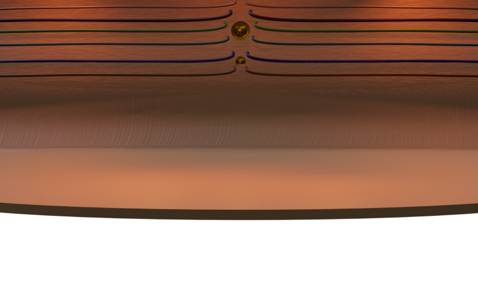
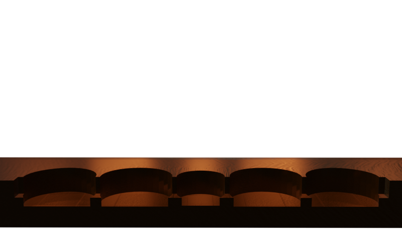
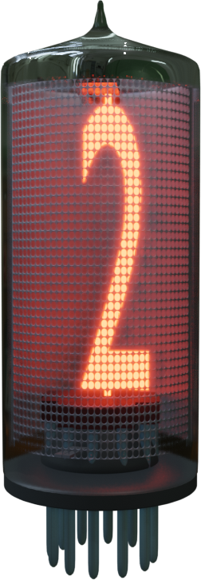
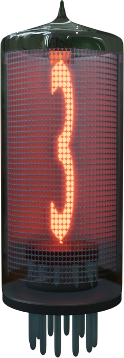
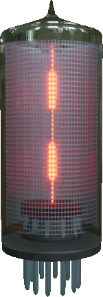
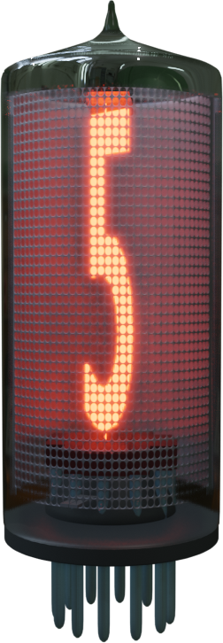
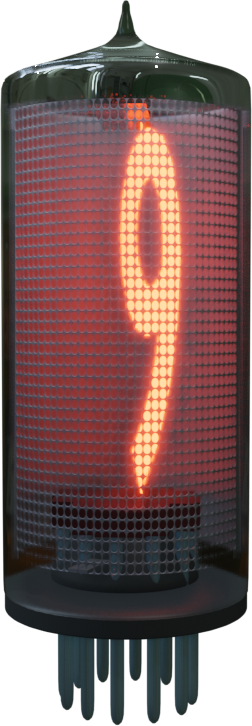
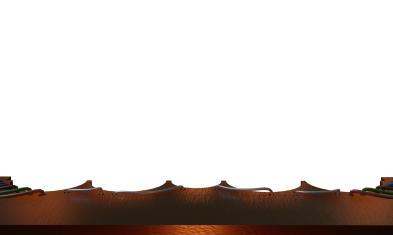
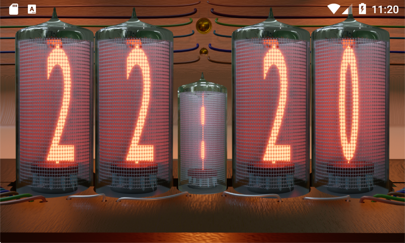

# THE steam punk NIXIE tube digital CLOCK

IMPORTANT: This project is totally based on the starter "digital_clock" provided by Flutter:
*https://github.com/flutter/flutter_clock.git*

.Technical
****
*specs*

* forces the dark theme
* forces landscape mode
* uses transparent images
* uses gif images
****

.Technical
****
*gimmicks*

* does calculations based on media queries +
  to determine the appropriate positions for the tubes.
* has 4 layer ( for *future parallax effect* )
****

=== Layering

background plate::

    wood texture ( *customizable - in the future* )

___
mid plate::

    wood block ( *customizable - in the future* ) +
    holds the nixie tubes in place

___

main plate::

    nixie tubes +
    holds the the row of nixie tubes

_ _
 _
 _
 _
 _
 _ _

___

front plate::

    wooden mask +
    holds part of the wireing +
    and "electronics"

== Bringing it all together

